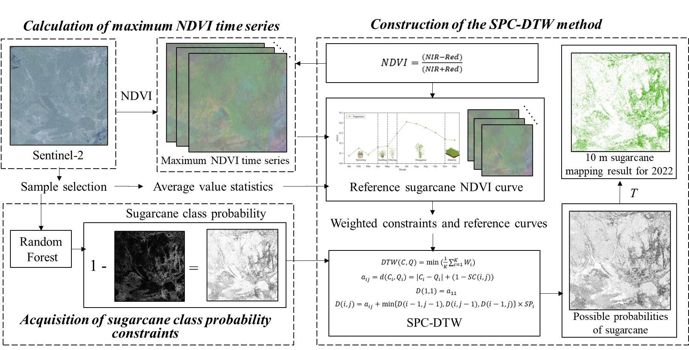

Zhu, L., Sun, W., Zhang, Y. et al. A Dynamic Time Warping Method Integrating Sugarcane Phenology Characteristics and Class Probabilities using Sentinel-2 NDVI Time Series. Sugar Tech (2025). https://doi.org/10.1007/s12355-025-01638-7
https://link.springer.com/article/10.1007/s12355-025-01638-7

# SPC-DTW

Figure shows the general idea of the SPC-DTW method. Firstly, 12 months of maximum NDVI time series data were calculated using 2022 Sentinel-2 images to minimise the effect of cloudiness. Secondly, class probability constraints for sugarcane were calculated using the corresponding training sample points and the random forest method to provide time penalty weights for the subsequent acquisition of sugarcane information. Finally, the sugarcane time series curves were constructed by combining the intra-annual growth cycle of sugarcane, and the weighted DTW was calculated for the sugarcane phenology in January-February and November-December, and then suitable threshold was selected to obtain the 2022 10 m sugarcane mapping results.

Figure. The process of the SPC-DTW method

https://code.earthengine.google.com/f5c5c123367c8386bdb8655b2a355713
